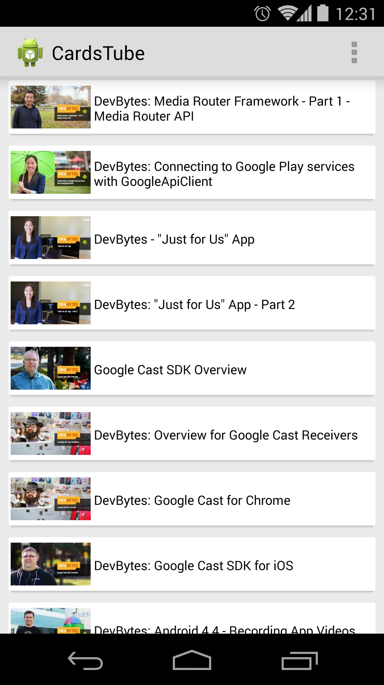

CardsTube
=========

A youtube playlist inside CardsLib.

Based on [this proyect](https://github.com/akoscz/YouTubePlaylist).

You need the awesome library CardsLib by Gabriele Mariotti.

You can download from [this page](https://github.com/gabrielemariotti/cardslib)

* **Sample** application: The demo is a showcase of the functionality of the library.

	 
	 
* **Extras** application: The demo-extras contains some examples of integration with other libraries
	
	

Other libraries used:
- [DiskLruCache](https://github.com/JakeWharton) by Jake Wharton
- [google-gson](https://code.google.com/p/google-gson/downloads/list)
- [Picasso](https://github.com/square/picasso) by Square

Developed By
============

Antonio Corrales desarrollogit@gmail.com

License
=======

Copyright 2014 Antonio Corrales

    Licensed under the Apache License, Version 2.0 (the "License");
    you may not use this file except in compliance with the License.
    You may obtain a copy of the License at

       http://www.apache.org/licenses/LICENSE-2.0

    Unless required by applicable law or agreed to in writing, software
    distributed under the License is distributed on an "AS IS" BASIS,
    WITHOUT WARRANTIES OR CONDITIONS OF ANY KIND, either express or implied.
    See the License for the specific language governing permissions and
    limitations under the License.
